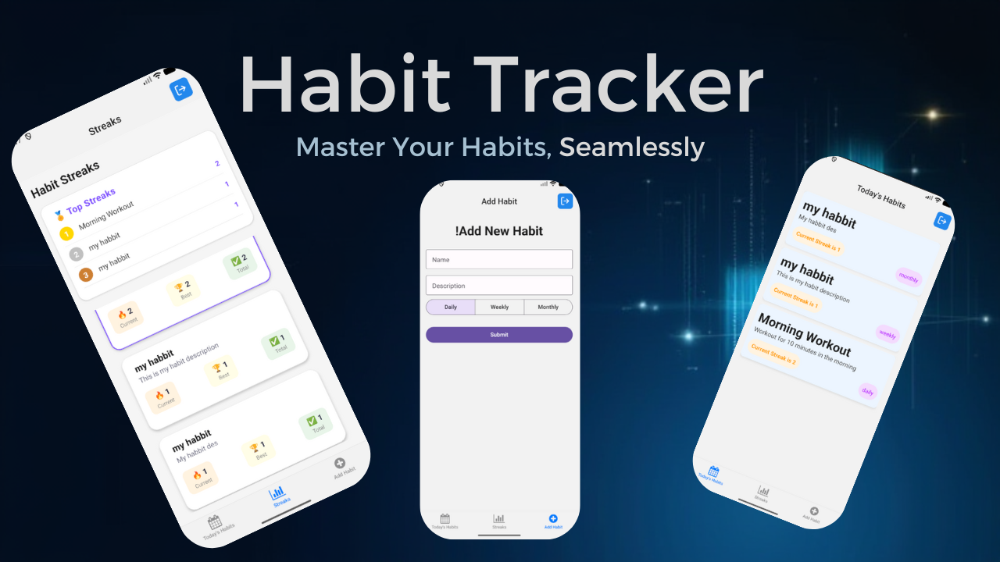

# 🚀 Habbit Tracker



A modern, cross-platform habit tracking application built with React Native and Expo, powered by Appwrite. This app helps users define, track, and manage their daily, weekly, or monthly habits, visualize their progress through streaks, and stay motivated.

## ✨ Features

-   **User Authentication**: Secure user registration and login powered by Appwrite.
-   **Habit Management**: Create, view, update, and delete habits with ease.
-   **Flexible Frequencies**: Set habits for daily, weekly, or monthly completion.
-   **Swipe Actions**: Intuitive swipe gestures to mark habits as complete or delete them.
-   **Streak Tracking**: Monitor current and best streaks for each habit.
-   **Real-time Updates**: Instant synchronization of habit data and streaks using Appwrite's real-time capabilities.
-   **Streak Leaderboard**: See your top habits ranked by best streaks.
-   **Cross-Platform**: Developed with Expo for seamless deployment on Android, iOS, and Web.

## 🛠 Technologies Used

-   **Frontend**:
    -   [React Native](https://reactnative.dev/)
    -   [Expo](https://expo.dev/) (with Expo Router)
    -   [TypeScript](https://www.typescriptlang.org/)
    -   [React Native Paper](https://reactnativepaper.com/) for UI components
    -   [React Native Gesture Handler](https://docs.swmansion.com/react-native-gesture-handler/) for swipe actions
    -   [@expo/vector-icons](https://docs.expo.dev/versions/latest/sdk/vector-icons/)
-   **Backend**:
    -   [Appwrite](https://appwrite.io/) (Self-hosted backend-as-a-service)
        -   Authentication
        -   Database
        -   Realtime capabilities
    -   [react-native-appwrite](https://www.npmjs.com/package/react-native-appwrite) (Appwrite SDK for React Native)

## ⚙ Installation

To get this project up and running on your local machine, follow these steps:

### Prerequisites

-   Node.js (LTS version recommended)
-   npm or Yarn
-   Expo CLI (`npm install -g expo-cli`)
-   An Appwrite instance (local or remote) with the following setup:

### Appwrite Setup

1.  **Install Appwrite**: Follow the official [Appwrite Installation Guide](https://appwrite.io/docs/installation) to set up your Appwrite instance.
2.  **Create Project**: In your Appwrite console, create a new project. Note down the **Project ID**.
3.  **Create Database**: Create a new database. Note down the **Database ID**.
4.  **Create Collections**:
    -   **Habits Collection**: Create a collection named `habits` (or similar) with the following attributes:
        -   `user_id` (String, required, indexed)
        -   `name` (String, required, min length 5)
        -   `description` (String, optional)
        -   `frequency` (String, required, e.g., 'daily', 'weekly', 'monthly')
        -   `streak_count` (Integer, required, default 0)
    -   **Habit Completions Collection**: Create a collection named `habit_completions` (or similar) with the following attributes:
        -   `habbit_id` (String, required, indexed)
        -   `user_id` (String, required, indexed)
        -   `completed_at` (Datetime, required, indexed)
5.  **Set Permissions**: Configure read/write permissions for your collections to allow authenticated users to create, read, update, and delete their own habits and completions.
6.  **Environment Variables**: Create a `.env` file in the root of your project based on `.env.example` and fill in your Appwrite details:

    ```env
    EXPO_PUBLIC_APPWRITE_ENDPOINT=YOUR_APPWRITE_ENDPOINT
    EXPO_PUBLIC_APPWRITE_PROJECT_ID=YOUR_APPWRITE_PROJECT_ID
    EXPO_PUBLIC_APPWRITE_PLATFORM=YOUR_APP_PLATFORM_ID_FROM_APPWRITE_CONSOLE (e.g., com.yourcompany.appname for Android/iOS)
    EXPO_PUBLIC_APPWRITE_DATABASE_ID=YOUR_APPWRITE_DATABASE_ID
    EXPO_PUBLIC_APPWRITE_HABBITS_COLLECTION_ID=YOUR_HABITS_COLLECTION_ID
    EXPO_PUBLIC_APPWRITE_HABBITS_COMPLETIONS_COLLECTION_ID=YOUR_HABIT_COMPLETIONS_COLLECTION_ID
    ```

### Frontend Setup

1.  **Clone the repository**:
    ```bash
    git clone https://github.com/marloonline123/habbit-tracker.git
    cd habbit-tracker
    ```
2.  **Install dependencies**:
    ```bash
    npm install
    # or
    yarn install
    ```
3.  **Start the Expo development server**:
    ```bash
    npm start
    # or
    yarn start
    ```
    This will open a new tab in your browser with the Expo Developer Tools. You can then run the app on an Android emulator, iOS simulator, or your physical device by scanning the QR code with the Expo Go app.

## 🚀 Usage

1.  **Register/Login**: Upon launching the app, you'll be prompted to register a new account or log in with existing credentials.
2.  **Add Habits**: Navigate to the "Add Habit" tab to create new habits by providing a name, description, and frequency.
3.  **Track Habits**: On the "Today's Habits" screen, you can see all your active habits.
    -   **Swipe Left** on a habit card to mark it as complete.
    -   **Swipe Right** on a habit card to delete it.
4.  **View Streaks**: Go to the "Streaks" tab to see your current and best streaks for each habit, along with a ranking of your top habits.

## 🤝 Contributing

Contributions are welcome! If you have suggestions for improvements or new features, please follow these steps:

1.  Fork the repository.
2.  Create a new branch (`git checkout -b feature/your-feature-name`).
3.  Make your changes.
4.  Commit your changes (`git commit -m 'feat: Add new feature'`).
5.  Push to the branch (`git push origin feature/your-feature-name`).
6.  Open a Pull Request.

## 📄 License

This project is licensed under the MIT License - see the [LICENSE](LICENSE) file for details.
